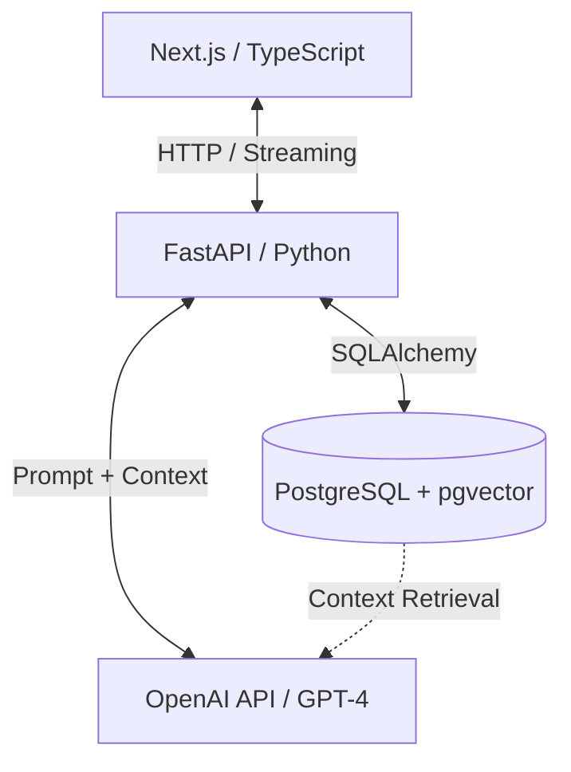
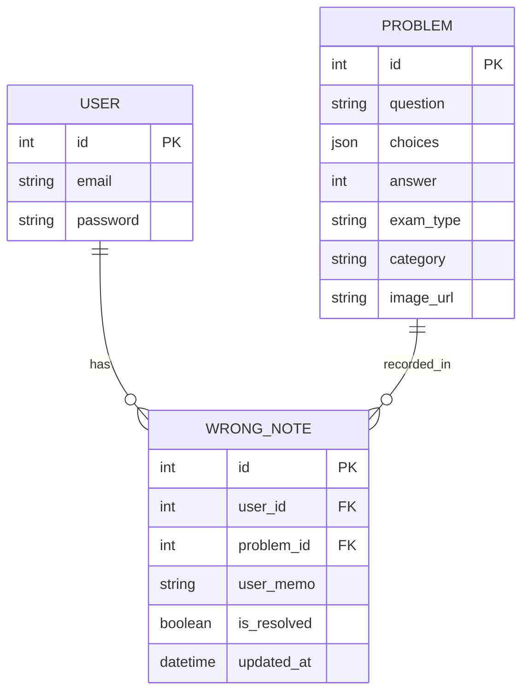

# 🚗📚 PassMate AI (패스메이트 AI)
> **AI 기반 개인 맞춤형 시험 학습 코치 플랫폼**  
> "학습 ➔ 분석 ➔ 피드백 ➔ 맞춤 추천까지 수험생의 학습 성장 구조 전체를 AI가 밀착 관리합니다."

  
  
  
  
  
  
  
  

---

## 🔗 1. 서비스 링크 및 데모 (Live & Demo)

* **배포 주소:** [🚀 PassMate AI 서비스 바로가기 (AWS)](https://your-live-link-here.com)
* **테스트 계정:** `test@passmate.com` / `password123!`

### 🎬 핵심 루프 시연 (5~10s GIF)
| 📝 문제 풀이 및 실시간 채점 | 🤖 RAG 기반 AI 맞춤형 해설 |
| :---: | :---: |
|  |  |

---

## 🎯 2. 프로젝트 개요 (Overview)

### 2.1 기존 문제은행 서비스의 한계
기존 CBT 서비스는 단순 문제 제공과 채점에만 치우쳐 있어, 수험생이 자신의 약점을 정밀하게 분석하고 오답의 원인을 깊이 있게 이해하기 어려웠습니다.

### 2.2 PassMate AI의 차별성
PassMate AI는 **"문제 풀이 ➔ 자동 채점 ➔ 오답 관리 ➔ RAG 기반 심화 해설 ➔ 약점 시각화"**로 이어지는 유기적인 학습 성장 시스템을 제공하여 외부 검색 없이 플랫폼 내부에서 모든 궁금증을 해결합니다.

---

## 🏗️ 3. 시스템 아키텍처 및 데이터 구조

### 3.1 서비스 아키텍처 (Architecture)

### 3.2 데이터베이스 구조 (ERD)

---

## ✨ 4. 핵심 기능 (Key Features)

### 📊 약점 분석 대시보드
* **시각화 리포트:** 단원별 정답률 및 시험별 성취도를 **Radar Chart**와 **Bar Chart**로 제공하여 한눈에 메타인지를 높입니다.
* **학습 추세:** 최근 학습 이력 데이터를 기반으로 성취도 변화 그래프를 출력합니다.

### 🤖 RAG 기반 AI 코칭 시스템
* **선택지별 오답 분석:** 틀린 문제의 정답 근거뿐만 아니라, 사용자가 고른 오답 보기의 오답 원인까지 정밀 분석합니다.
* **꼬리 질문 대응:** 제공된 해설 외에 추가적인 궁금증은 챗봇 인터페이스를 통해 즉각적인 질의응답이 가능합니다.

### 📝 오답 관리 및 다시 풀기
* 틀린 문항은 오답노트에 자동으로 수집되며 복습 상태 관리 및 개인 메모 작성을 지원합니다.

---

## 🔒 5. 제약 사항 및 안전성 설계 (Constraints)

> 💡 **"근거 중심 · 검증 우선 · 모호성 제거"**의 3대 원칙을 철저히 준수합니다.

1. **데이터 저작권 안전보장**
   * 인사혁신처 및 도로교통공단 등 공공기관이 공개한 문제은행 데이터만 정제하여 활용합니다. (시중 유료 교재 및 강의자료 배제)
2. **할루시네이션(Hallucination) 원천 차단**
   * OpenAI API 활용 시, 데이터베이스 내부의 검증된 문제·정답·키워드 콘텍스트를 RAG 파이프라인으로 묶어 전달합니다.
   * 내부 데이터베이스 내에 명확한 근거 데이터가 부족한 경우, 유효하지 않은 답변을 지어내지 않고 **"정보 없음(데이터베이스 내 확인 불가)"** 메시지를 명시하도록 예외 로직을 포함했습니다.

---

## 👥 6. 팀원 및 프로젝트 일정

### 6.1 팀 구성 및 기술 스택
| 담당 역할 | 이름 | 활용 기술 및 책임 업무 |
| :--- | :--- | :--- |
| **AI & Planning** | **김선희** | - AI 서비스 기획, 요구사항 분석 및 로드맵 수립 - OpenAI API 연동, Prompt Engineering 및 RAG 파이프라인 설계 |
| **Backend** | **이춘우** | - FastAPI 기반 코어 API 설계 및 PostgreSQL 연동 - pgvector를 활용한 벡터 유사도 검색 및 인프라(AWS) 구축 |
| **Frontend** | **신혜진** | - TypeScript 및 Next.js 프레임워크 기반 컴포넌트 설계 - Tailwind CSS 기반 UI/UX 가독성 확보 및 실시간 차트 시각화 |

### 6.2 3주간의 스프린트 타임라인 (Timeline)
* **🟦 Week 1 (설계):** DB 모델링, pgvector 파이프라인 구성, 피그마 기반 화면 설계 및 UI 컴포넌트 마크업
* **🟨 Week 2 (개발):** 문제 조회/채점 API 구현, RAG 기반 AI 해설 파이프라인 검증, 프론트-백엔드 연동
* **🟥 Week 3 (고도화):** 오답노트 비즈니스 로직 완성, Chart.js 활용 대시보드 구축, Docker 컨테이너라이징 및 AWS EC2 최종 배포

---

## 🔮 7. 향후 확장 계획 (Future Vision)

* **시험 카테고리 확장:** 한국사능력검정시험, 정보처리기사, SQLD 등의 핵심 자격증 데이터 추가 레이어 구축
* **AI 스케줄러:** 목표 시험 일정을 기반으로 개인 맞춤형 일일 문제 풀이 분량 및 복습 타이밍 자동 추천
* **합격 예측:** 누적 단원 정답률 데이터를 기반으로 실제 시험 기준 합격 확률 시뮬레이션 모델 도입
* **보이스 코칭:** 이동 중에도 학습할 수 있는 오디오 기반 오답 피드백 기능 개발
